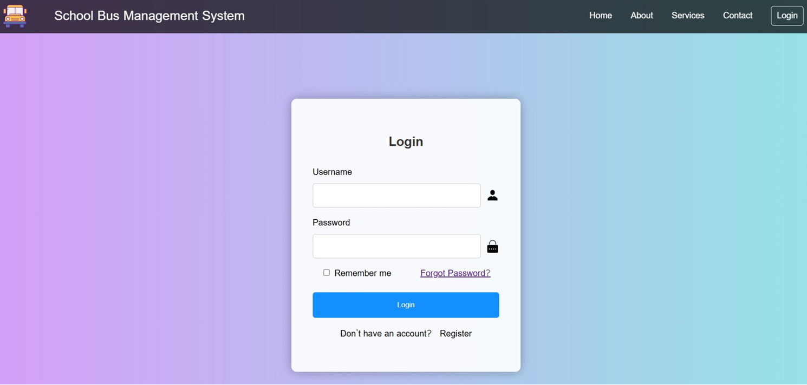
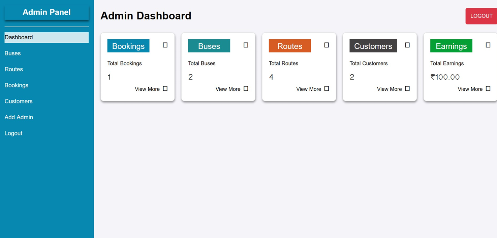
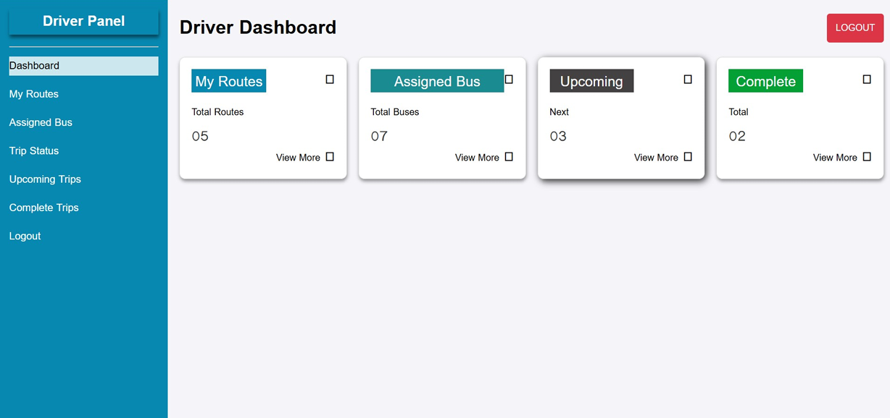
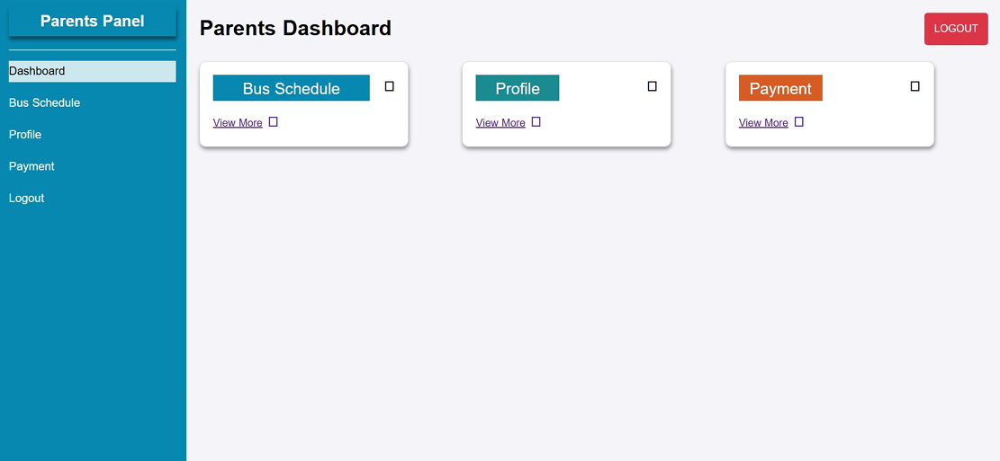
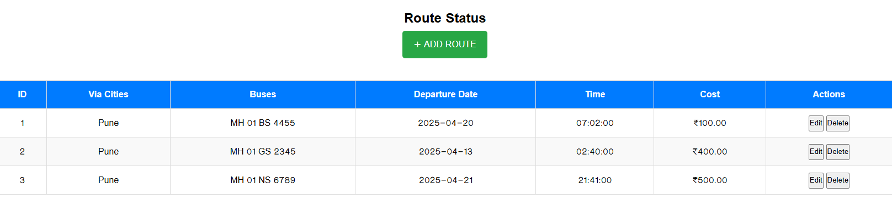

# 🚌 School Bus Management System (SBMS)

---

### 📖 Short Description
The **School Bus Management System** is a robust platform built to solve real-world logistical challenges in school transportation. It allows administrators to manage a fleet of buses, assign drivers to specific routes, and handle student/parent bookings efficiently. This system ensures safety, transparency, and organized data management for educational institutions.

---

### ✨ Features

*   **👑 Admin Dashboard**: Centralized control for all operations with real-time analytics.
*   **🚐 Bus Management**: Easily add, update, and track bus details (Bus Numbers, Capacities, Status).
*   **📍 Route Management**: Define routes, specific stops, and optimized arrival/departure schedules.
*   **👨‍✈️ Driver Assignment**: Efficiently link professional drivers to specific buses and routes.
*   **🎫 Booking & Assignment**: Manage student and parent seat bookings with automated confirmation.
*   **👥 User Management**: Specialized panels and roles for Admins, Drivers, and Parents.
*   **🔐 Secure Authentication**: Robust login and registration system using modern encryption.

---

### 🛠️ Tech Stack

*   **Frontend**: 
    *   HTML5 & CSS3 (Modern Responsive UI)
    *   JavaScript (ES6+)
    *   Google Fonts & FontAwesome Icons
*   **Backend**: 
    *   **PHP**: Core business logic and administrative modules
    *   **Node.js / Express**: RESTful API support and secure authentication
*   **Database** (This project uses **both** MySQL and MongoDB):
    *   **MySQL**: Structured data storage for users, buses, and routes.
    *   **MongoDB**: Flexible storage for API-driven modules (Auth, JWT).
*   **Tools & Libraries**: 
    *   XAMPP / WAMP for local environment
    *   JWT (JSON Web Tokens) for modern auth
    *   Bcryptjs for password hashing

---

### 📂 Project Structure

```text
SCHOOL-BUS-MANAGEMENT/
├── Backend/                 # Express.js API (Auth, JWT, MongoDB)
│   ├── controllers/         # Request handlers & logic
│   ├── models/              # Database schemas (Mongoose)
│   ├── routes/              # API endpoints
│   └── index.js             # Server entry point
├── Frontend/                # PHP Web Application (UI & Core Logic)
│   ├── Driver/              # Driver dashboard & assigned views
│   ├── Parents/             # Parent/Student portal
│   ├── admin_dashboard.php  # Main administrative control
│   ├── login.php            # PHP-based secure login
│   └── register.php         # User registration systems
├── assets/                  # Images, Logos, and CSS styles
├── database/                # SQL/NoSQL database export scripts
└── README.md                # Project documentation
```

---

### 🚀 Installation & Setup

Follow these simple steps to get the project running locally:

**1. Clone the Repository**
```bash
git clone https://github.com/aaryanighut/SCHOOL-BUS-MANAGEMENT.git
cd SCHOOL-BUS-MANAGEMENT
```

**2. Setup Backend (Node.js)**
*   Navigate to the `Backend` folder.
*   Install dependencies:
    ```bash
    npm install
    ```
*   Create a `.env` file and add your `MONGO_URI` and `JWT_SECRET`.
*   Start the server:
    ```bash
    npm start
    ```

**3. Setup Frontend (XAMPP)**
*   Move the project folder to your XAMPP `htdocs` directory.
*   Start **Apache** and **MySQL** from the XAMPP Control Panel.
*   Import the provided database script into **phpMyAdmin**.

**4. Run the Project**
*   Open your browser and visit: `http://localhost/SCHOOL-BUS-MANAGEMENT/Frontend/login.php`

---

### 💻 Usage

*   **Admin**: Log in to manage the entire fleet, define routes, assign drivers, and view performance analytics.
*   **Driver**: Securely log in to see assigned routes, student lists, and bus timing schedules.
*   **Student/Parent**: Use the portal to view bus details, track assigned routes, and manage personal transport bookings.

---

## 📷 Screenshots

### 📸 Login Page


### 📊 Admin Dashboard


### 👨‍✈️ Driver Dashboard


### 🚚 Parent Dashboard


### 📍 Route Details


---

### 🔐 Authentication

The system implements a dual-layer authentication strategy:
*   **PHP Session Management**: Used for maintaining user states within the core application.
*   **JWT (JSON Web Tokens)**: Used for secure, stateless communication between the frontend and the Express API.
*   **Password Hashing**: All passwords are encrypted using **Bcrypt** to ensure maximum security.

---

### 🌍 Future Enhancements

*   🛰️ **Real-time GPS Tracking**: Integration with Google Maps API for live location updates.
*   📱 **Dedicated Mobile App**: A React Native app for parents to receive push notifications.
*   📧 **Automated Notifications**: SMS and Email alerts for bus delays or emergencies.
*   💳 **Online Fee Payment**: Integration with Stripe/Razorpay for transport fees.

---

### 🤝 Contributing

Contributions are what make the open-source community such an amazing place!
1. Fork the Project
2. Create your Feature Branch (`git checkout -b feature/AmazingFeature`)
3. Commit your Changes (`git commit -m 'Add some AmazingFeature'`)
4. Push to the Branch (`git push origin feature/AmazingFeature`)
5. Open a Pull Request

---


### 👨‍💻 Author

*   SBMS Development Team

    Aaryan Nighut<br>
    Aarya Nighut<br>
    Ekanksh Mohite<br>
    Rahul Yadav<br>

*   **GitHub**: [AaryaNighut](https://github.com/AaryaNighut)

---
*Made with ❤️ for better school transportation.*
